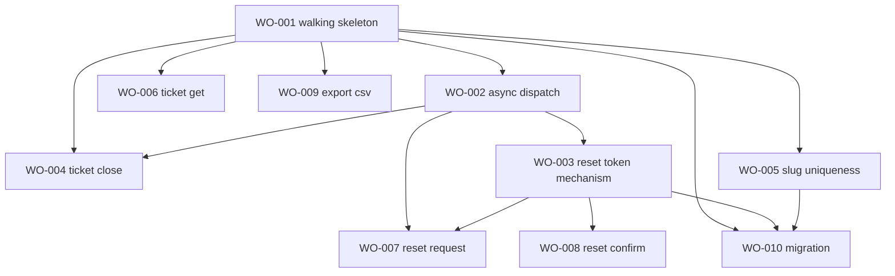

# Backlog — ticketd rewrite

Ordering: usage weight + pain weight first (effort follows usage and pain), subject to
topological order on dependencies (P8). Full detail lives in each `docs/features/WO-*.md`;
this is the map. Machine state (status, verification results, gate approvals) lives in
`ledger.json` — this file is the human-readable plan, not the source of truth for status.

## Milestone 0 — Walking skeleton (GATE)

The thin end-to-end slice: stack skeleton + the two highest-traffic routes, proving the
twin-boot harness works before anything else is built on top of it.

| WO | Title | Depends on | Usage wt | Pain wt | Risk | Gate |
|---|---|---|---|---|---|---|
| WO-001 | Walking skeleton: FastAPI+Postgres setup, GET/POST /api/tickets | — | 0.829 | 0.1 | 0.55 | **yes** |

**M0 close criteria**: `verification/harness/run-modern.sh` implemented (no longer the
generated stub); `diff-run.sh tickets-list` and `diff-run.sh tickets-create` both green;
`modern/CLAUDE.md`'s FREE choices recorded in `ledger.json`. Human sign-off required before M1
starts.

## Milestone 1 — The three named fixes + remaining ticket/auth surface

| WO | Title | Depends on | Usage wt | Pain wt | Risk | Gate | Notes |
|---|---|---|---|---|---|---|---|
| WO-002 | Async notification dispatch (PB-001) | WO-001 | 0.069* | 0.9 | 0.68 | **yes** | infra, not a route |
| WO-003 | Reset token mechanism (PB-002) | WO-001, WO-002 | 0.0295* | 0.9 | 0.72 | **yes** | security-sensitive |
| WO-004 | Ticket close (uses WO-002) | WO-001, WO-002 | 0.0495 | 0.7 | 0.45 | no | the actual June-incident route |
| WO-005 | Slug uniqueness (PB-003) | WO-001 | 0.2115* | 0.5 | 0.6 | **yes** | **blocked on OQ-001 ruling** |
| WO-006 | Ticket get | WO-001 | 0.092 | 0.0 | 0.35 | no | |
| WO-007 | Auth reset request (uses WO-002, WO-003) | WO-002, WO-003 | 0.0195 | 0.9 | 0.55 | no | |
| WO-008 | Auth reset confirm (uses WO-003) | WO-003 | 0.01 | 0.3 | 0.4 | no | |

\* usage weight shown is the underlying route(s)' weight; WO-002/003 are infra consumed by
other WOs' routes, WO-005 shares POST /api/tickets' weight since it modifies that route.

**M1 close criteria**: full regression replay across all M0+M1 suites; human review of any new
`expected-divergence` entries (ED-001, ED-002 are expected to be added here — see each WO's
divergence notes); WO-005 may slip past M1 if OQ-001 is still unruled — that's expected
behavior per the executor loop (skip, continue elsewhere), not a milestone failure.

## Milestone 2 — Low-priority surface + data migration

| WO | Title | Depends on | Usage wt | Pain wt | Risk | Gate | Notes |
|---|---|---|---|---|---|---|---|
| WO-009 | Admin export CSV | WO-001 | 0.0 | 0.0 | 0.3 | no | check OQ-004 first — may become a do-not-port instead |
| WO-010 | Data migration execution | WO-001, WO-003, WO-005 | n/a | n/a | 0.75 | **yes** | human-gated by design; census unrun, multiple ASK policies |

## Explicitly not backlogged

- **Password-changing functionality** — no route in legacy does this either (OQ-008); not
  requested by any PB entry. Do not add.
- **UI changes** — PB-005, hard non-goal.
- **New features beyond PB-001/002/003's fixes** — OIQ-2 (open intake question) flags this as
  unconfirmed; default assumption is same-behavior replatform only.

## Dependency graph

## Parallel execution note

Between control points (gates, open ASKs), the unblocked WO frontier may run as a workflow
across worktree-isolated subagents — see root `CLAUDE.md`. Given this app's size (5 legacy
source files, 7 routes, 10 WOs total), serial single-session execution is entirely reasonable
and is the recommended default; the dependency graph above is shallow enough that parallelism
buys little beyond WO-006/WO-009 running alongside the WO-002→003→007/008 chain.
