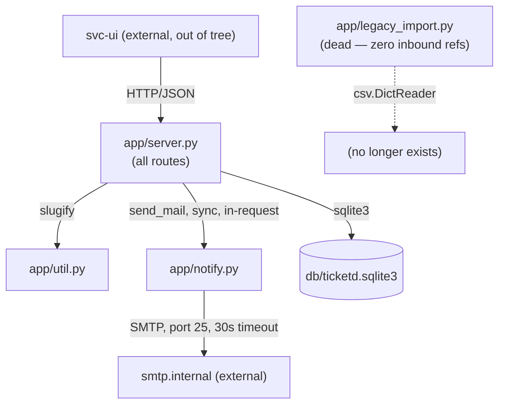

# System Overview — ticketd

ticketd is a small internal ticket tracker: a single Flask 1.x-era process (`ticketd/app/server.py`,
125 lines) backed by SQLite (`ticketd/db/ticketd.sqlite3`, schema in `ticketd/db/schema.sql`),
serving a JSON API to a separate frontend (`svc-ui`, seen only as a `User-Agent` string in
`ticketd/ops/access.log` — its source is not part of this legacy tree, and per PB-005 its
behavior contract must not change). There is no service boundary inside the app: routing,
validation, persistence, and notification dispatch all live in one file, called directly and
synchronously from each Flask view function. Running since 2019 per `ticketd/README.md`.

## Subsystem table

| Subsystem | Responsibility | Member modules | Routes | Tables |
|---|---|---|---|---|
| **Tickets** | CRUD-ish lifecycle for tickets: list, create, fetch one, close | `app/server.py` (routes only — no separate module) | `GET /api/tickets`, `POST /api/tickets`, `GET /api/tickets/<id>`, `POST /api/tickets/<id>/close` | `tickets`, `users` (FK only, never written by any route) |
| **Auth/Reset** | Password-reset token issuance, rate limiting, and confirmation | `app/server.py` (routes) | `POST /api/auth/reset`, `POST /api/auth/reset/confirm` | `reset_tokens` |
| **Notifications** | Outbound email on ticket-close and reset-token issuance | `app/notify.py` | none (called, not routed) | none |
| **Slugging** | Human-readable identifier derived from ticket title | `app/util.py` | none (called, not routed) | none (writes into `tickets.slug`) |
| **Admin/Export** | CSV dump of all tickets for audit purposes | `app/server.py` (one route) | `GET /internal/export/csv` | `tickets` (read-only) |
| **(dead) Import** | 2019 spreadsheet-era one-off importer | `app/legacy_import.py` | none — not wired to any route or entrypoint | none |

There is no subsystem boundary at the code level (all routes live in one Flask file); the
table above groups by *responsibility*, which is how P4 features are cut and how P8 groups
work orders. Ticket and Auth/Reset are the two subsystems carrying real usage — see
`usage-weights.json` (Tickets ~97.5% of matched traffic, Auth/Reset ~2.9%, Admin/Export ~0%).

## Dependency diagram

## External integration points

- **Outbound**: SMTP to `smtp.internal:25` via `smtplib.SMTP(..., timeout=30)`
  (`ticketd/app/notify.py:6`) — synchronous, in-request, on two call sites (ticket close,
  reset request). This is PB-001's entire mechanism. No retry, no queue, no circuit breaker;
  a slow or down SMTP server directly slows or fails the HTTP request that triggered it.
- **Inbound**: none beyond the HTTP API itself. No webhooks received, no cron jobs found in the
  tree (no scheduler config, no `cron`/`schedule` imports).
- **Client**: `svc-ui/2.1` per the access log User-Agent — a single consumer as far as the
  evidence shows (all 2000 sampled log lines carry this UA; no other client identified).
- **Auth boundary**: none inside the app — see `docs/problem-brief.md` OIQ-4 / OQ-002. Every
  route is reachable with no credential. The access log's authenticated-looking user field
  (`jdoe@corp.example.com`, in the position an authenticating proxy's injected identity would
  occupy) is circumstantial evidence of an upstream auth layer, not proof; unresolved.

## Notable absences (confirmed, not assumed)

- No test suite anywhere in the legacy tree (zero test files found in P1 inventory).
- No migrations directory — `db/schema.sql` is the only schema artifact; SQLite implies it was
  likely applied by hand or via `sqlite3 < schema.sql`.
- No config/env file — `DB_PATH`, `smtp.internal`, port `5000`, and all tunables
  (`RESET_WINDOW_MIN`, `RATE_LIMIT_PER_HOUR`) are hard-coded module constants in
  `app/server.py:14-17`.
