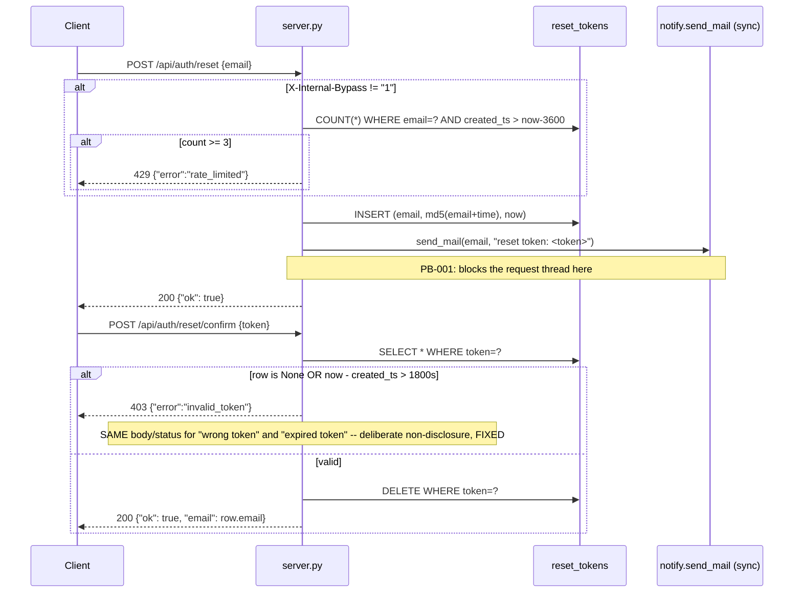

# Entity: Reset Token

## Fields (cited: `ticketd/db/schema.sql:18-22`, writers/readers: `ticketd/app/server.py:80-108`)

| Field | Type | Nullable | Notes |
|---|---|---|---|
| `email` | TEXT | no | The address the reset was requested for. **No FK to `users`** — a reset can be
  requested for any email string, including ones with no matching `users` row (the route never
  checks `users` at all — see `docs/domain/user.md`). |
| `token` | TEXT | no | `hashlib.md5(f"{email}{time.time()}").hexdigest()` (`server.py:90`) — this is PB-002 in full: a non-cryptographic digest of two knowable-ish inputs, not a CSPRNG secret. |
| `created_ts` | REAL | no | `time.time()` (Unix epoch seconds, float) at issuance. Used for both rate-limiting (count in the last hour) and expiry (30-minute window) checks. |

**No primary key. No index of any kind — not on `token`, not on `email`.** Every lookup
(`SELECT ... WHERE token = ?` at confirm time, `SELECT COUNT(*) WHERE email = ? AND
created_ts > ?` at request time) is a full table scan as the table grows. This is a secondary,
non-security consequence of PB-002's "bare table" framing worth carrying into the migration
DDL even though the brief's framing was about token strength, not performance.

## Lifecycle

## Invariants

- **Rate limit**: 3 requests/hour per email, **enforced app-level only**, and only when the
  request does **not** carry `X-Internal-Bypass: 1` (`server.py:84`). This header is
  undocumented anywhere in the codebase, comments, or README. It is exactly the kind of
  behavior `references/schema.md`'s ASK example describes: a real, evidenced code path whose
  *intent* (legitimate internal-tooling bypass? forgotten debug backdoor? something a pentest
  should flag?) cannot be determined from source alone. **`ASK` — see
  `docs/open-questions.md` OQ-006.** Not corroborated by any PB entry — the brief never
  mentioned it, so it is not a `REPAIR` target, just an open question about what `FIXED` even
  means here.
- **Expiry**: 30 minutes (`RESET_WINDOW_MIN = 30`, `server.py:16`), enforced app-level only at
  confirm time — no DB-level expiry, no cleanup job found anywhere in the tree for expired
  rows (they simply accumulate until confirmed or forever if never confirmed). This is a
  second, distinct consequence of PB-002 worth folding into WO-003's target schema (an indexed,
  properly-expiring token store), even though the brief's PB-002 text is about hash strength.
- **Single-use**: enforced — `DELETE ... WHERE token = ?` immediately on successful confirm
  (`server.py:106`), before the success response is returned. `FIXED`, preserve exactly.
- **Non-disclosure**: invalid and expired tokens return the identical `403
  {"error":"invalid_token"}` — explicitly called out as deliberate in a code comment
  (`server.py:104`). `FIXED`, preserve exactly; this is good security practice already in
  place and must survive PB-002's REPAIR of the token mechanism itself.
