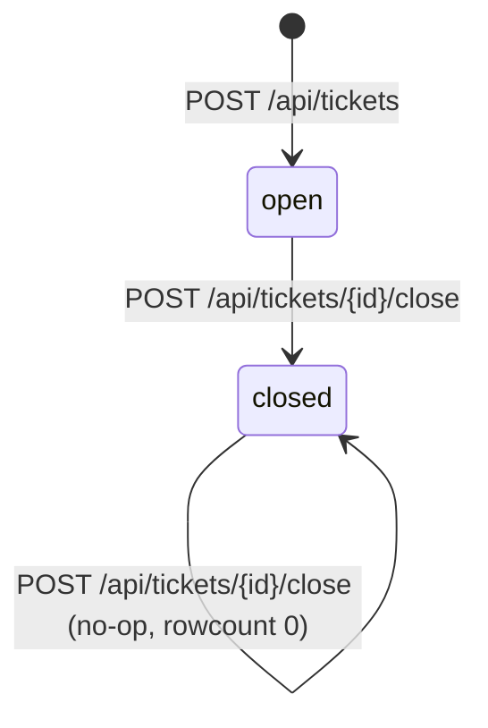

# Entity: Ticket

## Fields (cited: `ticketd/db/schema.sql:1-10`, writers: `ticketd/app/server.py`)

| Field | Type | Nullable | Notes |
|---|---|---|---|
| `id` | INTEGER PK | no | SQLite `rowid` alias (autoincrement by SQLite default behavior) |
| `title` | TEXT | no (`NOT NULL`) | Also app-level: `create_ticket` rejects empty/whitespace-only title with 422 (`server.py:44`) — the DB constraint alone would accept an empty string, so this is an app-layer rule, not just a schema one |
| `slug` | TEXT | no (`NOT NULL`) | **No `UNIQUE` constraint** despite being a slug (PB-003). Computed once at create time via `slugify(title)` (`server.py:51,55`); never recomputed on update — there is no update-title route, so this is moot today but matters if one is ever added |
| `priority` | TEXT | yes (CHECK only, not NOT NULL) | `CHECK (priority IN ('low','med','high'))` — enforced at DB level. App normalizes `"1"/"2"/"3"` to `low/med/high` before insert (`server.py:47-49`); defaults to `"med"` string if omitted from the request body entirely (`server.py:47`) |
| `status` | TEXT | no (`NOT NULL`) | `CHECK (status IN ('open','closed'))`. Set to `'open'` at create (`server.py:51`, hardcoded in the INSERT, not app-computed), `'closed'` only via the close route |
| `assignee_id` | INTEGER | yes | `REFERENCES users(id)` — **no route in this codebase ever reads or writes this column.** Zero evidence of use; not promoted to do-not-port because it's a live schema column with an FK, not dead code — likely set out-of-band (DB console, or a caller not in this tree) |
| `created_at` | DATETIME | no (`NOT NULL`) | Written via `datetime.now().isoformat()` — **naive local time, no timezone offset stored** (flagged in the code itself: `server.py:52` `# naive local time!`). See `docs/open-questions.md` OQ-003 |
| `closed_at` | DATETIME | yes | Same naive-local-time mechanism, written only by the close route (`server.py:71`) |

## Lifecycle

- No re-open route exists. `closed` is terminal as far as the API surface goes.
- Close is idempotent at the response level but not silently — `changed` (SQL `rowcount`) is
  `0` on an already-closed or nonexistent ticket, and the response body reflects it faithfully:
  `{"closed": false}` (`server.py:69-77`). No error status is returned for either case — both
  "already closed" and "doesn't exist" produce `200 {"closed": false}`. This conflates two
  distinct causes into one signal; not flagged as a defect by the brief, so `FIXED` — but noted
  here since it's easy to miss.
- Closing a ticket sends a notification email **synchronously in the same request**
  (`server.py:76`) — this is PB-001's second call site (the first is reset-request).

## Invariants

- `title` non-empty: **enforced**, app-level (`server.py:44`, `HTTP 422 {"error":
  "title_required"}`). DB-level `NOT NULL` alone does not enforce non-blank.
- `priority ∈ {low, med, high}`: **enforced**, DB-level CHECK constraint
  (`schema.sql:5`) backed by app-level normalization of numeric strings before insert.
- `status ∈ {open, closed}`: **enforced**, DB-level CHECK constraint (`schema.sql:6`).
- `slug` uniqueness: **NOT enforced**, anywhere (PB-003). This is the invariant the rewrite
  must add — see `docs/open-questions.md` OQ-001 for the still-open mechanism question.
- `assignee_id` referential integrity: DB-level `REFERENCES users(id)` — SQLite does not
  enforce foreign keys by default (`PRAGMA foreign_keys` is off unless set per-connection, and
  `app/server.py:db()` never sets it) — so this constraint is **declared but likely not
  actually enforced** at runtime today. Flagged as a discrepancy: the schema *suggests* an
  invariant that code does not *prove*. See `docs/open-questions.md` OQ-005.
