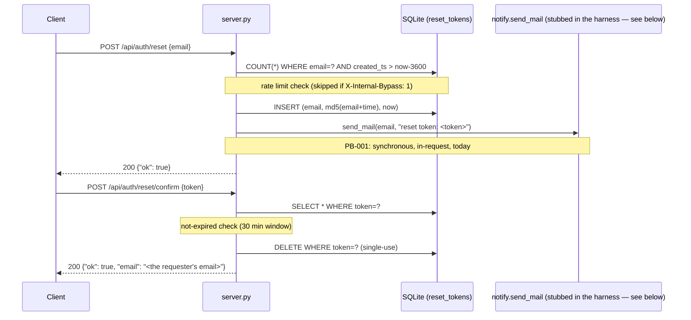

<!-- guide/flows/ storyboard: sequence diagram + a REAL captured trace, annotated. This is not
     illustrative data -- every value below is copied verbatim from
     verification/replay/traces/legacy/auth-reset-confirm.jsonl, captured by actually booting
     legacy and driving a real HTTP session through it (see verification/harness/README.md).
     The trace was also validated by the harness's required self-check (legacy vs. itself,
     0 unexpected diffs) before being trusted as a golden. -->

# Flow: password reset, request → confirm

## Sequence



## The real trace, annotated

Captured 2026-08-08 from a genuinely running legacy instance (`verification/harness/
legacy_wrapper.py`), seeded from `verification/replay/corpus/seed.sql`. SMTP is stubbed at the
harness level (see `verification/harness/README.md`) — everything else, including the actual
MD5 token generation and the actual SQLite writes, is real legacy code executing.

**Step 1 — request** (trace id `auth-reset-confirm-001a-request`)
```json
POST /api/auth/reset  {"email": "confirm-flow@example.com"}
→ 200 {"ok": true}
```
Post-request state: `reset_tokens` now holds one row —
```json
{"email": "confirm-flow@example.com", "token": "e323b55919c18e7145ad957272c76ab2", "created_ts": 1786243403.108275}
```
Notice what the token looks like: 32 lowercase hex characters — the unmistakable shape of an
MD5 digest. That's PB-002 in one glance. Nothing in the `200 {"ok": true}` response gives any
hint of this — the token is only ever visible in the (stubbed, in this harness) outbound email
and in the database row itself.

**Step 2 — confirm** (trace id `auth-reset-confirm-001b-happy`)
```json
POST /api/auth/reset/confirm  {"token": "e323b55919c18e7145ad957272c76ab2"}
→ 200 {"ok": true, "email": "confirm-flow@example.com"}
```
Post-request state: `reset_tokens` is now `[]` — the row is gone. Single-use, confirmed by
actually watching the table empty out, not just by reading the `DELETE` statement in source.

## What the rewrite changes here (and what it doesn't)

- The MD5 token shape you see in step 1's captured state is exactly what WO-003 replaces —
  post-rewrite, this same flow produces a CSPRNG-generated token whose hash (not the raw value)
  is what lands in the database.
- The two 200 responses above — their shape, their fields, the two-step flow — are `FIXED`,
  unchanged by the rewrite.
- The synchronous `send_mail` call between step 1's request and response is what WO-002
  removes — in the rewritten flow, `POST /api/auth/reset` returns just as promptly whether or
  not the mail transport is healthy.

## A flow this storyboard does NOT show (also real, also captured)

`verification/replay/traces/legacy/auth-reset-confirm.jsonl` also contains
`auth-reset-confirm-002-unknown-token` and `-003-expired-token` — both produce the identical
`403 {"error": "invalid_token"}`, which is the deliberate non-disclosure behavior described in
`guide/legacy/auth-reset.md`. Read those two trace entries directly if you want to see the
"failure" side of this flow with the same level of realism as the happy path above.
