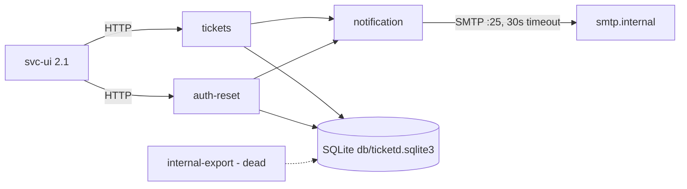

# ticketd — System Overview

One Flask module serving 7 routes over a 3-table SQLite database, with a synchronous SMTP
side-channel. Internal-only (clients: `svc-ui/2.1` per the access log). Running since 2019
(`ticketd/app/server.py:1`). ~168 LOC total (`inventory.json`).

## Subsystems

| Subsystem | Responsibility | Modules | Routes | Tables |
|---|---|---|---|---|
| tickets | CRUD-ish ticket lifecycle: list, create, get, close | `app/server.py:27-77`, `app/util.py` (slugify) | `GET /api/tickets`, `POST /api/tickets`, `GET /api/tickets/<id>`, `POST /api/tickets/<id>/close` | `tickets` (`users` referenced by FK only) |
| auth-reset | Password-reset token issue/confirm with rate limit | `app/server.py:80-108` | `POST /api/auth/reset`, `POST /api/auth/reset/confirm` | `reset_tokens` |
| notification | Outbound mail; shared by tickets-close and auth-reset | `app/notify.py` | — (side effect only) | — |
| internal-export | CSV dump for the 2020 audit — dead (DNP-001) | `app/server.py:111-115` | `GET /internal/export/csv` | `tickets` |
| import (dead) | 2019 spreadsheet importer — dead (DNP-002) | `app/legacy_import.py` | — | — |

Subsystem membership above is the fan-out enumeration for P4/P5/P9: every module in
`inventory.json` appears exactly once.

## Dependency diagram

## External integration points

- **Outbound SMTP** — `smtp.internal:25`, blocking, 30s timeout, no retry
  (`ticketd/app/notify.py:5-7`). Called in-request from close (`app/server.py:76`) and
  reset (`app/server.py:94`). This is PB-001.
- **Inbound HTTP only** — no queues, no cron, no webhooks (verified: whole app is
  `app/server.py`; no scheduler imports anywhere in the tree).
- **SQLite file** `db/ticketd.sqlite3`, path relative to CWD (`ticketd/app/server.py:14`),
  one connection per request via Flask `g` (`app/server.py:20-24`).

## Cross-cutting observations

- No authentication or authorization on any route, including `/internal/*`
  (`app/server.py` — no auth code exists). Presumably network-perimeter trust; the rewrite
  preserves this (PB-005: the UI sends no credentials) — flagged in `integration-notes.md`.
- Two time representations: naive local ISO strings (`tickets`) vs epoch UTC floats
  (`reset_tokens`) — see OQ-005.
- Response bodies are `jsonify(...)` JSON everywhere except the dead CSV route.
