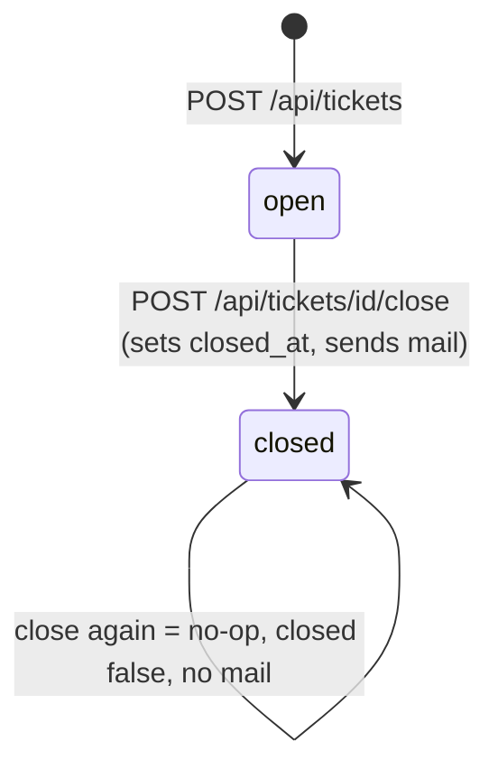

# Entity: Ticket

Table `tickets` (`ticketd/db/schema.sql:1-10`).

| field | type | notes / enforcement site |
|---|---|---|
| id | INTEGER PK | autoincrement rowid; returned on create (`app/server.py:55`) |
| title | TEXT NOT NULL | required; create rejects blank/missing with 422 `{"error":"title_required"}` (`app/server.py:44-45`) — whitespace-only is stripped then rejected |
| slug | TEXT NOT NULL | derived: `slugify(title)` at create (`app/server.py:52`); **no uniqueness constraint** (`schema.sql:4`) — collisions occur (PB-003). Write-only: nothing reads it back |
| priority | TEXT CHECK in (low, med, high) | DB-enforced enum (`schema.sql:5`). App coerces "1"/"2"/"3" → low/med/high, default "med", any other value passes through raw and violates the CHECK → 500 (`app/server.py:47-49`, OQ-007) |
| status | TEXT NOT NULL CHECK in (open, closed) | DB-enforced (`schema.sql:6`). Created as 'open' (`app/server.py:51`); only transition is open→closed via close route |
| assignee_id | INTEGER REFERENCES users(id) | FK declared (`schema.sql:7`) but **no code path ever writes it** (verified: no route touches assignee_id); FK enforcement is off by default in SQLite — orphan values possible (census probe generated) |
| created_at | DATETIME NOT NULL | naive local ISO string, `datetime.now().isoformat()` (`app/server.py:52` — "naive local time!") |
| closed_at | DATETIME | set on close with same naive format (`app/server.py:71`); NULL while open |

## Lifecycle

Enforcement: the open→closed transition guards on `status != 'closed'` in the UPDATE's
WHERE clause (`app/server.py:69-71`) — idempotent close, and the notification fires only
when a row actually changed (`app/server.py:73-76`). There is no reopen, no edit, no delete.

## Invariants (with enforcement evidence)

- I1: title non-empty after strip — app-enforced on create only (`app/server.py:43-45`).
- I2: status ∈ {open, closed} — DB CHECK (`schema.sql:6`).
- I3: priority ∈ {low, med, high} — DB CHECK (`schema.sql:5`); app coercion is partial (OQ-007).
- I4: closed tickets have `closed_at`; open have NULL — enforced by the only write paths
  (`app/server.py:51`, `:69-71`); not DB-enforced (a census probe checks historical dirt).
- NOT an invariant: slug uniqueness (PB-003).
