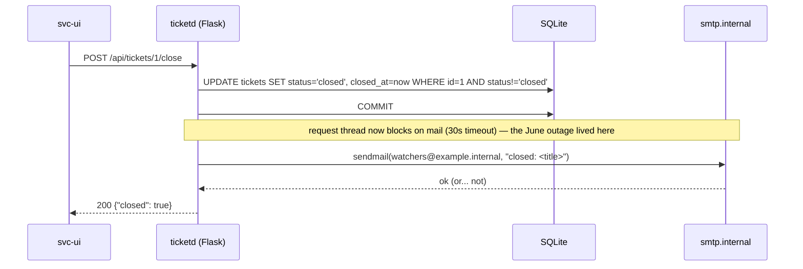

# Flow: closing a ticket

The flow that motivated the rewrite (PB-001). Sequence today:



## The real trace (t2-core.legacy.jsonl, captured at the pin)

`tickets-close-001` — closing seeded ticket #1:

```json
{"id": "tickets-close-001",
 "request": {"method": "POST", "path": "/api/tickets/1/close"},
 "response": {"status": 200, "body": {"json": {"closed": true}}},
 "state": {"email": {"mode": "sync",
                     "messages": [{"to": ["watchers@example.internal"],
                                   "body_redacted": "closed: Printer on 3rd floor jams"}]}}}
```

Step by step: the WHERE-guard makes close idempotent — `tickets-close-002` (same ticket
again) answers `{"closed": false}` and emits **no** mail; `tickets-close-003` (id 999)
is identical from the caller's seat. The commit lands *before* the send (CL-6), so mail
was always best-effort — just blocking.

## After the repair (ED-001)

Same request, same response, same mail content — but `state.email.mode` becomes `queued`:
the close transaction writes a `mail_outbox` row and returns; a worker delivers. The replay
differ passes this flow only when it diverges *exactly* that way, and NFR-1 re-runs it with
the mail sink down: the close must still succeed.
