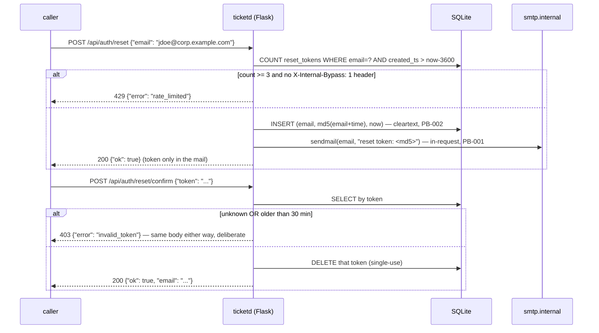

# Flow: password reset (request → mail → confirm)

## The real traces (t2-core.legacy.jsonl)

The captured session tells the whole story in order:
- `auth-reset-req-001..003` — three requests for the same address: 200 each, one mail each
  (`state.email.messages[0].body_redacted = "reset token: <TOKEN>"`), and
  `state.token_store.cleartext: true` — the emailed token sits verbatim in the DB. That
  predicate is exactly what ED-002 flips.
- `auth-reset-req-004` — the fourth inside the hour: **429**, no insert, no mail.
- `auth-reset-req-005` — same, but with `X-Internal-Bypass: 1`: sails through (OQ-002).
- `auth-reset-confirm-001` — with the first mail's token: `{"ok": true, "email": ...}`.
- `auth-reset-confirm-002` — the same token again: **403** — single-use, frozen.
- `auth-reset-req-007` — and because the bypassed request also inserted a row, the next
  plain request is rate-limited again (RR-4): the freeze captures even this interaction.

Expiry can't be traced without a time machine; it's characterization-tested instead with
the DB aging hook (`test_expired_token_same_body_as_invalid`, runs against both trees).

## After the repair (ED-002 + ED-003)

Identical responses at every step. The token in the mail becomes a long random string, the
DB keeps only its hash (`cleartext: false`), and the mail departs via the outbox
(`mode: queued`). Anything else that differs fails the run.
