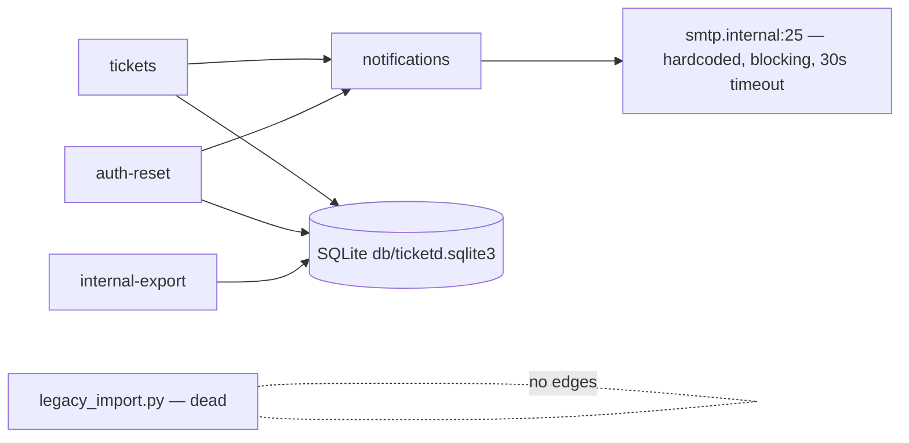

# ticketd — System Overview

Single-process Flask app (Flask 1.x era, running since 2019 per `ticketd/app/server.py:1`)
over a local SQLite file (`db/ticketd.sqlite3`, `ticketd/app/server.py:14`). Seven HTTP routes:
ticket CRUD-lite (list/create/get/close — no update, no delete, no assignment endpoint), a
password-reset token flow, and an internal CSV export. One outbound integration: SMTP, called
synchronously inside request handlers. No login endpoint, no sessions, no background jobs, no
cron. All evidence is code-derived (degraded mode — see `rebuild.json.evidence`).

## Subsystems

Membership below is the fan-out enumeration for P4/P5/P9 — every inventory file appears exactly once.

| Subsystem | Responsibility | Modules (members) | Routes | Tables |
|---|---|---|---|---|
| tickets | Ticket lifecycle: list, create, get, close; slug + priority normalization | `app/server.py:27-77` (route bodies), `app/util.py` | GET/POST `/api/tickets`, GET `/api/tickets/<id>`, POST `/api/tickets/<id>/close` | `tickets`, `users` (declared FK target only — no code reads/writes `users`; see OQ-002) |
| auth-reset | Password-reset token issue/confirm, rate limiting | `app/server.py:80-108` | POST `/api/auth/reset`, POST `/api/auth/reset/confirm` | `reset_tokens` |
| notifications | Outbound email; called by tickets (close) and auth-reset (issue) | `app/notify.py` | — | — |
| internal-export | CSV dump written for the 2020 audit | `app/server.py:111-115` | GET `/internal/export/csv` | `tickets` (read-only) |
| (dead) | One-off 2019 spreadsheet importer — zero inbound imports, zero routes | `app/legacy_import.py` | — | — |
| (schema) | DDL source of truth | `db/schema.sql` | — | all |

## Dependency diagram

## External integration points
- **SMTP** `smtp.internal:25` — hardcoded host, blocking send, 30s timeout
  (`ticketd/app/notify.py:6`). The only outbound call in the system. PB-001.
- Nothing else: no queues, no cron, no webhooks, no third-party APIs.

## Cross-cutting facts later phases depend on
- Timestamps: `tickets.created_at/closed_at` are **naive local-time ISO strings**
  (`ticketd/app/server.py:52,71` — in-code comment "naive local time!");
  `reset_tokens.created_ts` is a **unix epoch float** (`ticketd/app/server.py:92`).
- SQLite foreign keys are never enabled (no `PRAGMA foreign_keys` at connect,
  `ticketd/app/server.py:20-24`), so the declared `tickets.assignee_id → users.id` FK
  (`ticketd/db/schema.sql:7`) is **declared but unenforced** at runtime — dangling assignees
  are possible in production data (migration risk; census deferred, OQ-INT-2).
- No pagination anywhere; the UI "relies on getting everything" (`ticketd/app/server.py:35`).
- No authentication on any route, including `/internal/export/csv` and the rate-limit bypass
  header (`ticketd/app/server.py:84`).
