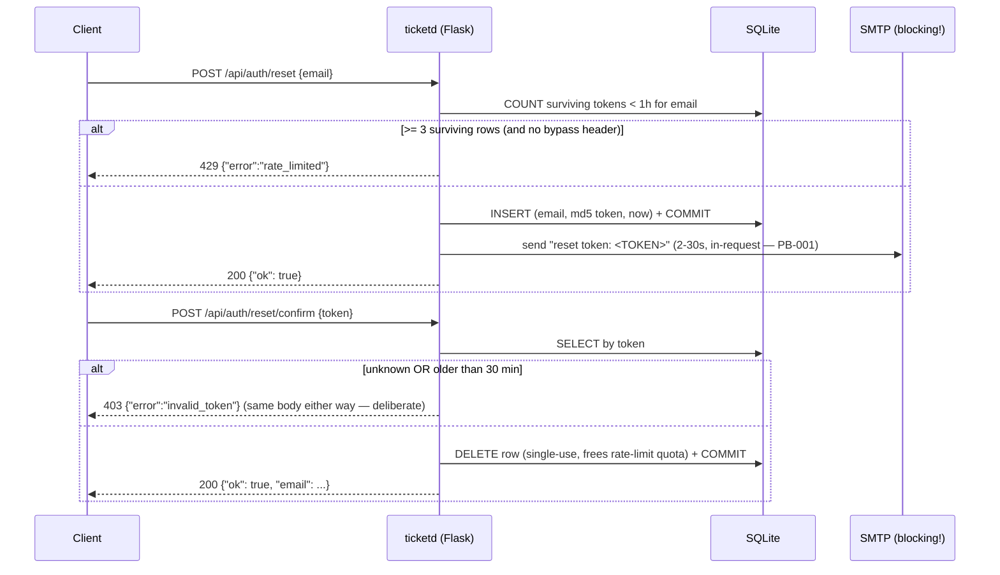

# Flow storyboard — a password reset, end to end

The trace below is REAL: captured from the running legacy app at the pinned ref
(verification/replay/traces/core.legacy.jsonl). Tokens are normalized to placeholders at
capture time.

## The captured traces, annotated

**reset-request-001** — request `{"email": "sam@example.internal"}` → `200 {"ok": true}`.
State shows the side effect the response hides:
`email_dispatch: {kind: reset_token, to: sam@example.internal, mode: sync, ref: <TOKEN:reset-request-001>}`
— `mode: sync` is the PB-001 defect in the wild; ED-002 requires `queued` from modern.

**reset-request-004-ratelimited** — the 4th request in the session → `429` (three surviving
rows). But see **rlr-request-004-after-refund** in ratelimit-refund.legacy.jsonl: after
confirming one token, the "4th" request is `200` — the refund semantics the audit caught
(A-01), demonstrated by the legacy app itself.

**reset-confirm-001** — `{"token": "$TOKEN[reset-request-001]"}` → `200 {"ok": true,
"email": "sam@example.internal"}`. The email echo is the entire output of the flow — and
nothing in this codebase consumes it (OQ-002).

**reset-confirm-002-reuse** — same token again → `403 {"error":"invalid_token"}`:
single-use, enforced by deletion.

**reset-confirm-004-expired-seed** — a token seeded 31 minutes old → the same 403 body as a
token that never existed. Expiry and nonexistence are deliberately indistinguishable.

## What changes in modern (and nothing else)
Token: CSPRNG, hashed at rest (ED-003). Email: queued (ED-002/ED-002b). Everything else in
this storyboard — statuses, bodies, windows, refund behavior, non-disclosure — replays
byte-identically under diff rules.
