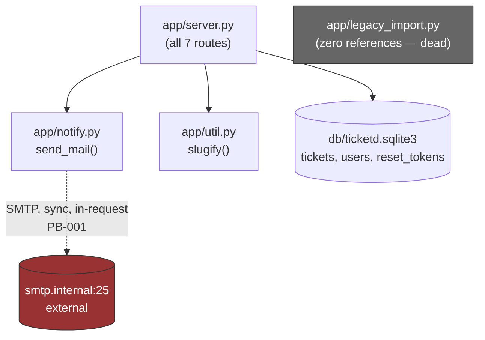

# System Overview — ticketd

<!-- P3. Generated code-only (degraded mode: no runtime evidence, no prod DB). -->

ticketd is a single-process Flask 1.x-era internal ticket tracker (`legacy/README.md`: "runs
since 2019") backed by a single SQLite file. The entire application is one route module
(`legacy/app/server.py`, 122 lines) plus two small helpers (`slugify`, `send_mail`) and one
unreferenced one-off importer. There is no auth/session layer beyond the password-reset flow
itself — nothing in the code gates ticket read/write behind a logged-in user (see
`docs/open-questions.md#OQ-004`).

## Subsystems

| Subsystem | Responsibility | Member modules | Routes | Tables |
|---|---|---|---|---|
| Tickets | CRUD-ish lifecycle for tickets: list, create, read-by-id, close | `legacy/app/server.py` (routes only — no separate module boundary in legacy), `legacy/app/util.py` (`slugify`) | `GET /api/tickets`, `POST /api/tickets`, `GET /api/tickets/<id>`, `POST /api/tickets/<id>/close` | `tickets` |
| Auth / Password Reset | Issue and redeem single-use reset tokens, rate-limited | `legacy/app/server.py` (routes only) | `POST /api/auth/reset`, `POST /api/auth/reset/confirm` | `reset_tokens` |
| Notifications | Outbound email; called by Tickets (on close) and Auth (on reset request) | `legacy/app/notify.py` | none (not a route; a cross-cutting call) | none |
| Admin / Export | CSV dump of all tickets | `legacy/app/server.py` (routes only) | `GET /internal/export/csv` | `tickets` (read) |
| Legacy Import (dead) | One-off 2019 spreadsheet importer | `legacy/app/legacy_import.py` | none — not wired to any route or import (do-not-port candidate, see `docs/do-not-port.md`) | none |

`users` table exists in the DDL and `tickets.assignee_id` references it, but **no code path in
`legacy/app/server.py` ever reads or writes `users` or `assignee_id`.** There is no route to
create a user, assign a ticket, or query by assignee. This is flagged as an open question
(`docs/open-questions.md#OQ-003`) rather than silently dropped or silently ported — it may be
scaffolding for a feature that was never finished, or a hand-populated table maintained outside
this codebase.

## Dependency diagram

## External integration points

- **SMTP** (`smtp.internal:25`, `legacy/app/notify.py:6`) — the only outbound integration. Called
  synchronously from two request handlers (PB-001). No retry, no queue, no circuit breaker; a
  bare `smtplib.SMTP(...)` context manager with a 30s timeout and no exception handling at the
  call sites, so a send failure propagates as an unhandled exception (Flask's default 500) after
  paying the connection-timeout cost.
- No queues, no cron jobs, no webhooks received or sent, no other external APIs. This is a
  small, self-contained CRUD service.

## Confidence note

This overview is code-only. No runtime evidence (P2 inactive) confirms which subsystems actually
carry traffic; usage assumptions used for backlog ordering (P8) are a static proxy, not measured.
