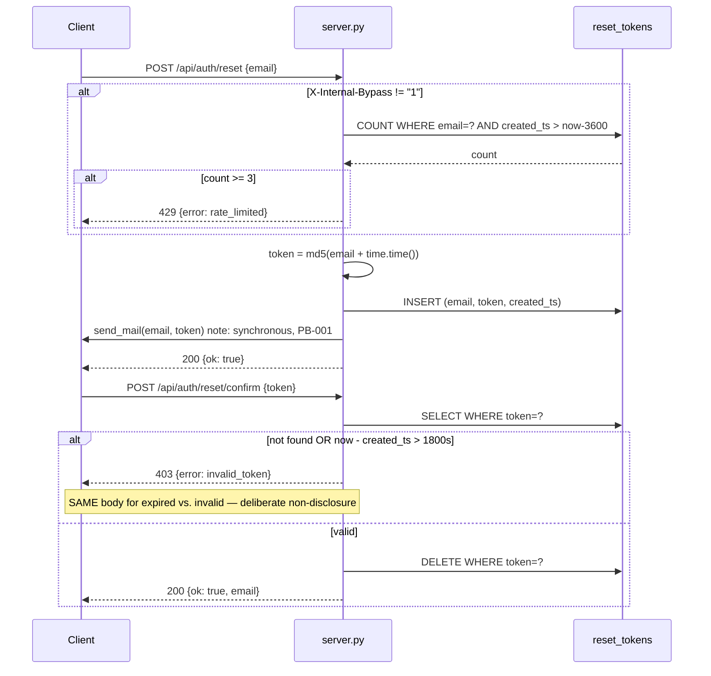

# Entity: Reset Token

## Fields (`legacy/db/schema.sql:18-22`)

| Field | Type | Constraint | Notes |
|---|---|---|---|
| `email` | TEXT | NOT NULL | not validated as an email shape anywhere; not checked against `users.email`, i.e. a reset can be requested for an address with no account (`server.py:81-95` never queries `users`) |
| `token` | TEXT | NOT NULL | **generated via `hashlib.md5(f"{email}{time.time()}".encode()).hexdigest()`** (`server.py:90`) — PB-002. No uniqueness constraint in the DDL; collision probability is astronomically low but nothing prevents it structurally. |
| `created_ts` | REAL | NOT NULL | `time.time()` (unix epoch float) — used for both rate-limiting and expiry math |

No primary key at all on this table (`db/schema.sql:18-22` — every other table has one; this one
doesn't). Rows are deleted individually by exact `token` match on confirm (`server.py:106`); nothing
ever cleans up expired-but-unconfirmed rows. Unbounded growth over time — code-observed, not
human-reported; logged as a PB-proposal (`docs/open-questions.md#OQ-006`), not auto-REPAIRed.

## Lifecycle

## Invariants

- **Enforced, FIXED, intentional (comment confirms intent, `server.py:104`):** expired and
  invalid tokens return the *identical* error body — non-disclosure so a caller can't
  distinguish "wrong token" from "right token, too old." Preserve exactly; this is exactly the
  kind of oddity that looks like a bug but is annotated as deliberate.
- **Rate limit:** 3 requests/hour per email (`RATE_LIMIT_PER_HOUR = 3`, `server.py:17`), **except**
  when the request carries header `X-Internal-Bypass: 1` (`server.py:84`), which is undocumented
  anywhere outside this one line of code. No PB entry mentions it, no docstring explains its
  intended caller. This is exactly the shape of thing the fidelity taxonomy exists for: it is
  real, evidenced code, so it is FIXED (must be preserved) — but it is also flagged as an ASK
  (`docs/open-questions.md#OQ-007`) because shipping an undocumented auth-rate-limit bypass into
  a fresh Postgres/FastAPI build without a human consciously deciding to keep it is the kind of
  thing that should get a deliberate yes, not a silent port.
- **Expiry window:** 30 minutes (`RESET_WINDOW_MIN = 30`, `server.py:16`), measured against
  `created_ts` (server-set, not client-supplied) — sound.
- **Single-use:** token is deleted on successful confirm (`server.py:106`) — sound, no replay
  possible on a used token.

## Confidence

All FIXED/ASK dispositions above are `cited` (file:line), none are `traced` (no runtime evidence
available this run — P2/P7-T1 inactive).
