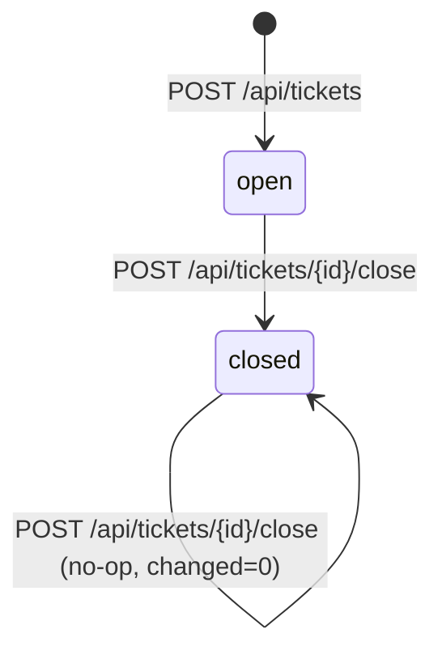

# Entity: Ticket

## Fields (from `legacy/db/schema.sql:1-10` + usage in `legacy/app/server.py`)

| Field | Type | Constraint | Notes |
|---|---|---|---|
| `id` | INTEGER | PRIMARY KEY | sqlite rowid alias |
| `title` | TEXT | NOT NULL | user-supplied; stripped of leading/trailing whitespace at create (`server.py:43`); empty-after-strip is rejected `422 {error: title_required}` (`server.py:44-45`) |
| `slug` | TEXT | NOT NULL | derived from `title` via `slugify()` (`util.py:4-6`); **no uniqueness constraint in the DDL, and none enforced in code** — collisions are possible, see Invariants below |
| `priority` | TEXT | CHECK IN ('low','med','high') | accepted from clients as either the string values directly, or `"1"`/`"2"`/`"3"` which are mapped `1->low, 2->med, 3->high` (`server.py:47-49`); anything else is stored verbatim and would violate the CHECK constraint at insert time (untested path — no evidence of what the client-visible error looks like when that happens; the sqlite CHECK would raise `sqlite3.IntegrityError`, which Flask has no handler for, so today it's an unhandled 500) |
| `status` | TEXT | NOT NULL, CHECK IN ('open','closed') | always created as `'open'` (`server.py:51`); only transition in code is `open -> closed` via close endpoint; no reopen path exists |
| `assignee_id` | INTEGER | REFERENCES users(id) | **dead column** — no code path reads or writes it. See `docs/open-questions.md#OQ-003`. |
| `created_at` | DATETIME | NOT NULL | `datetime.now().isoformat()` — **naive local time, not UTC, not timezone-aware** (`server.py:52`, comment itself flags this: `# naive local time!`). Not a reported defect (PB register), so ported FIXED pending a ruling — see `docs/open-questions.md#OQ-001`. |
| `closed_at` | DATETIME | nullable | same naive-local-time construction, set only by the close endpoint (`server.py:71`) |

## Lifecycle

Evidence: `server.py:69-71` — the UPDATE has `AND status != 'closed'` in its WHERE clause, so
closing an already-closed ticket is a no-op (`rowcount` 0) and the endpoint returns
`{"closed": false}` rather than erroring (`server.py:73-77`). No email is sent on the no-op path
(the `send_mail` call is inside `if changed:`).

## Invariants

- **Enforced (DB, `db/schema.sql:6`):** `priority` in `{low, med, high}`; `status` in
  `{open, closed}`. Cited as CHECK constraints — real invariants, not just suggested ones.
- **NOT enforced — code-observed, not human-reported (candidate PB-proposal, see
  `docs/open-questions.md#OQ-005`):** `slug` uniqueness. `util.py:5` comment even names the
  collision case explicitly: "Fix DB" and "fix db!" both slugify to `fix-db`. No unique index on
  `tickets.slug`, no check-before-insert in `server.py:50-54`. Whether downstream code depends on
  slug uniqueness is unknown (nothing in this repo looks up a ticket by slug — `slug` is returned
  from create/list/get but never queried by).
- **NOT enforced:** `assignee_id` referential integrity is declared in the DDL
  (`REFERENCES users(id)`) but SQLite does not enforce foreign keys unless
  `PRAGMA foreign_keys = ON` is set, and nothing in `server.py` sets it. Moot in practice since no
  code path writes `assignee_id` at all.

## Behaviors worth flagging (see WO-002)

- `GET /api/tickets/<id>` on a missing ticket returns **`200` with an empty JSON object `{}`**,
  not `404` (`server.py:58-64`, comment: "historical quirk ... the legacy UI depends on it"). This
  is FIXED (ported as-is) — it's the one place the legacy comment itself asserts a caller
  dependency, which is exactly the bar for keeping an odd behavior rather than "fixing" it.
- `GET /api/tickets` has no pagination — the code comment states the UI relies on receiving
  every row and filtering client-side (`server.py:35`). FIXED; flagged as a scale risk in
  `docs/problem-brief.md`'s open intake questions (no NFR target exists to say when this breaks).
