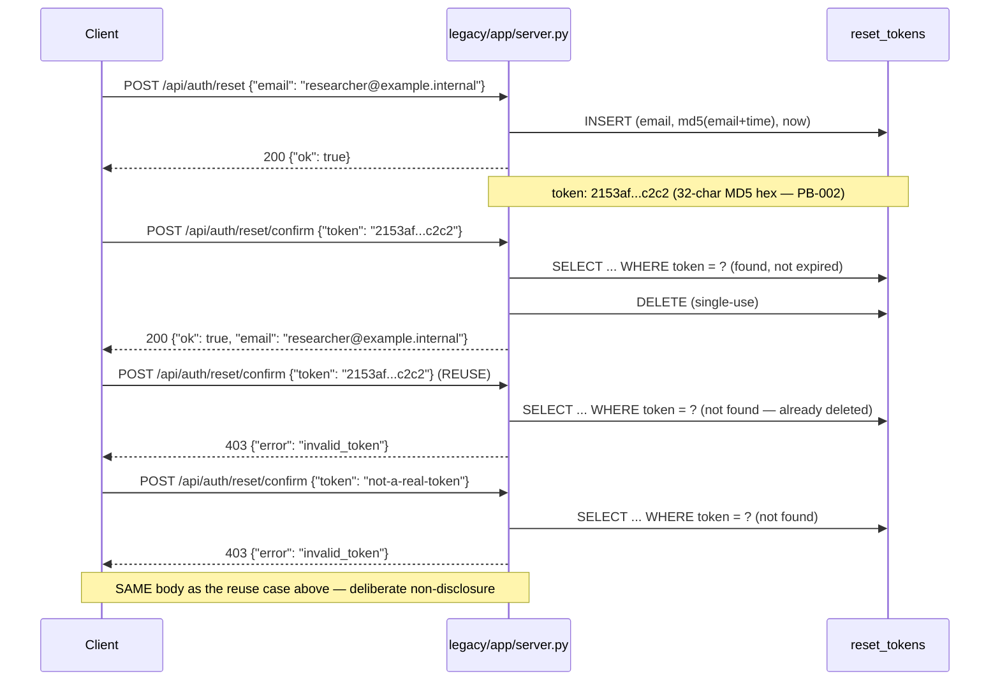

# Flow: Password Reset (request → confirm)

<!-- P10. Per the field-guide procedure: "reuse the replay corpus as teaching material... an
     actual password reset walking through the system beats any prose description." Every step
     below is a REAL captured trace against a REALLY-BOOTED legacy instance (not a derived
     guess) — see verification/replay/traces/auth-reset-legacy.jsonl, traces 001-004. Legacy
     boots locally in this repo (Flask + SQLite, SMTP stubbed) — see
     verification/harness/README.md for how, and why that's notable given no other runtime
     evidence exists for this workspace. -->

## Sequence



## Step-by-step, against the real trace

**1. Request** (`verification/replay/traces/auth-reset-legacy.jsonl`, trace
`auth-reset-001-request`)

```json
// request
{"method": "POST", "path": "/api/auth/reset", "body": {"email": "researcher@example.internal"}}
// response
{"status": 200, "body": {"ok": true}}
// post-run state (reset_tokens table)
{"email": "researcher@example.internal", "token": "2153af4315cbacc6e4b8b2468492c4c2", "created_ts": 1786242830.321625}
```

Notice what the response DOESN'T contain: the token. It only ever reaches the client via the
(stubbed, for this harness) email — `verification/harness/smtp_stub.py`'s recorded send for
this exact run: `{"to": ["researcher@example.internal"], "body": "reset token:
2153af4315cbacc6e4b8b2468492c4c2"}`. The token is a 32-character lowercase-hex string — that
shape is MD5's hexdigest, and it's exactly what PB-002 flags: predictable given the email and an
approximate request time, because there's no random secret in the input to `hashlib.md5(...)`.

**2. Confirm (valid)** (trace `auth-reset-002-confirm-valid`)

```json
{"body": {"token": "2153af4315cbacc6e4b8b2468492c4c2"}}
// -> {"status": 200, "body": {"ok": true, "email": "researcher@example.internal"}}
// post-run state: reset_tokens is now EMPTY -- the row was deleted (single-use)
```

**3. Confirm (reuse the same token)** (trace `auth-reset-003-confirm-already-used`) and
**4. Confirm (a token that was never issued)** (trace `auth-reset-004-confirm-bogus-token`) both
produce byte-for-byte the same response: `403 {"error": "invalid_token"}`. This is the detail
most worth internalizing from this whole flow — an attacker who reuses a captured token, or
guesses randomly, gets no signal telling them which case they hit. That's intentional (see
`docs/domain/reset-token.md`), and it's exactly the kind of behavior a well-meaning "cleanup"
could accidentally break by splitting into `410 Gone` vs `404 Not Found`, for instance. Don't.

## What changes in the rewrite

PB-002 (REPAIR, `ED-002`): step 1's token generation becomes a CSPRNG call instead of an MD5
hash — the shape of the token in the response/log changes, but every other step in this diagram
stays identical. PB-001 (REPAIR, `ED-001b`): step 1's email dispatch moves out of the
request/response cycle — the `200 {"ok": true}` response should arrive faster and can no longer
fail because of an SMTP problem. Neither REPAIR touches steps 2-4 at all.
