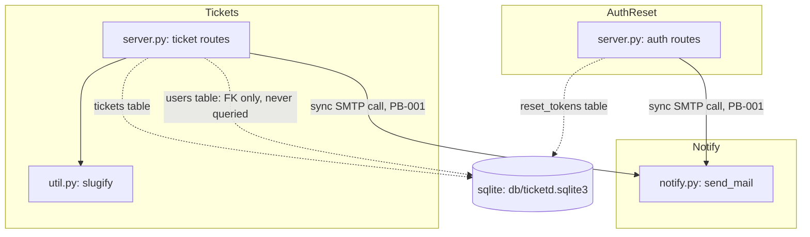

# System Overview — ticketd

ticketd is a small internal ticket tracker: a single Flask process (`app/server.py`, 122 lines)
backed by sqlite, exposing 7 HTTP endpoints across two functional areas — ticket CRUD-lite and
password-reset auth — plus one unauthenticated CSV export route. There is no background worker,
no queue, no cache, and no frontend in the handover (routes only; UI is referenced in comments
but not present in `legacy/`). Notifications are sent synchronously via SMTP inside two of the
request handlers (PB-001). This overview and everything under `docs/domain/` is built from static
reading of `legacy/` only — no runtime evidence was available (`docs/no-runtime-evidence-report.md`).

## Subsystems

| Subsystem | Responsibility | Member modules | Routes | Tables |
|---|---|---|---|---|
| **Tickets** | Create, list, fetch, and close tickets; CSV export | `app/server.py` (ticket handlers), `app/util.py` (`slugify`) | `GET /api/tickets`, `POST /api/tickets`, `GET /api/tickets/<id>`, `POST /api/tickets/<id>/close`, `GET /internal/export/csv` | `tickets` |
| **Auth/Reset** | Password-reset token issuance and confirmation | `app/server.py` (auth handlers) | `POST /api/auth/reset`, `POST /api/auth/reset/confirm` | `reset_tokens` |
| **Notify** (cross-cutting, not routed) | Outbound email; called synchronously by both subsystems above | `app/notify.py` | none (internal only) | none |
| **(dead) Import** | One-off 2019 spreadsheet importer | `app/legacy_import.py` | none | none — see `docs/do-not-port.md` |

`users` is defined in `db/schema.sql` (id, email, name) and referenced by `tickets.assignee_id`
as a foreign key, but **no route in `legacy/` reads or writes the `users` table at all** — no
assignment endpoint exists. This is a static-evidence finding (schema has a table + FK that the
code never touches), not a problem-brief entry (not reported by the requester); see
`docs/domain/user.md` and treat `users`/assignment as out of behavioral scope for this rewrite's
first pass — flagged, not silently ported as "done."

## Dependency diagram

## External integration points

- **SMTP**: `smtplib.SMTP("smtp.internal", 25, timeout=30)` — the only outbound integration in
  the app (`legacy/app/notify.py:6`). No retry, no queue, no circuit breaker. This is the whole
  surface of PB-001.
- No queue, no cache, no cron, no webhook receivers, no third-party API calls found anywhere in
  `legacy/`.
- Storage: sqlite file at `db/ticketd.sqlite3`, opened per-request via Flask's `g` (`app/server.py:20-24`),
  no connection pool, no migrations tooling (`db/schema.sql` is applied by hand, presumably).

## Notes on evidence tier

Every claim above is a source citation (T3/static). No trace or production observation backs
any of it — see `docs/no-runtime-evidence-report.md`. Treat this overview as accurate to the code
as pinned (`legacy_ref` in `rebuild.json`), not as a description of what actually runs in
production today.
