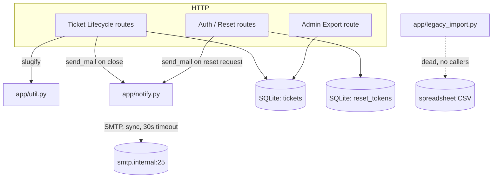

# System Overview — ticketd

ticketd is a small internal Flask 1.x + SQLite ticket tracker ("runs since 2019" per its own
module docstring, `ticketd-nohistory/app/server.py:1`): a single Flask app (`app/server.py`, 122
LOC, 7 routes) backed by 3 SQLite tables, with synchronous outbound SMTP notifications and a
password-reset flow. There is no authentication on any endpoint (see `docs/open-questions.md`
OQ-001) and no background job runner — every side effect happens inline in the request handler.

## Subsystems

| Subsystem | Responsibility | Member modules | Routes | Tables |
|---|---|---|---|---|
| Ticket Lifecycle | create/list/read/close tickets | `app/server.py` (routes only; no separate module), `app/util.py` (slug generation) | `GET /api/tickets`, `POST /api/tickets`, `GET /api/tickets/<id>`, `POST /api/tickets/<id>/close` | `tickets`, (FK-only reference to `users`, see below) |
| Auth / Password Reset | request + confirm password-reset tokens | `app/server.py` (routes only) | `POST /api/auth/reset`, `POST /api/auth/reset/confirm` | `reset_tokens` |
| Admin Export | CSV dump of all tickets | `app/server.py` (routes only) | `GET /internal/export/csv` | `tickets` (read-only) |
| Notifications | outbound SMTP | `app/notify.py` | none (called from Ticket Lifecycle + Auth, not a route itself) | none |
| *(dead)* Legacy Import | one-off CSV importer, "2019 spreadsheet era" | `app/legacy_import.py` | none | none — see `docs/do-not-port.md#dnp-001` |

There is no separate "Users" subsystem despite a `users` table existing in the schema — see
**Schema/code gap** below.

## Dependency diagram

## External integration points

- **Outbound SMTP** (`app/notify.py:6`): `smtplib.SMTP("smtp.internal", 25, timeout=30)`, plain
  (no TLS/auth in code), synchronous, called from two sites: `close_ticket` and `request_reset`.
  This is PB-001. No retry, no queue, no circuit breaker.
- **No inbound integrations, no webhooks, no cron/scheduled jobs** found anywhere in the tree.
- **No auth provider / session mechanism** — every route is open (see OQ-001).

## Schema/code gap: `users` table is entirely unused

`db/schema.sql` defines a `users` table (`id`, `email` UNIQUE, `name`) and `tickets.assignee_id`
references it — but no route, module, or code path anywhere in the legacy tree reads, writes, or
exposes either. Grep for `users`/`assignee` across the tree turns up only the two DDL lines.
This could mean: (a) assignment was planned but never shipped, (b) it's populated/used by a
process outside this repo (e.g. a script or another service also pointed at the same SQLite file
— unknown, no evidence either way), or (c) truly dead schema. Filed as **OQ-005** — it blocks
nothing structurally (no WO currently needs to touch `users`) but affects the P6 migration
decision (whether to carry the table forward at all) and is worth a human's five seconds before
M0. See `docs/domain/ticket.md` and `docs/open-questions.md`.

## Where to start reading

`ticketd-nohistory/app/server.py` is the entire application logic (routes + inline SQL); the
other three app modules are single-purpose helpers. `db/schema.sql` is the entire data model.
There is no framework scaffolding, no config layer, no test suite, and no separate service layer
to get oriented in — this overview *is* effectively the whole map.
