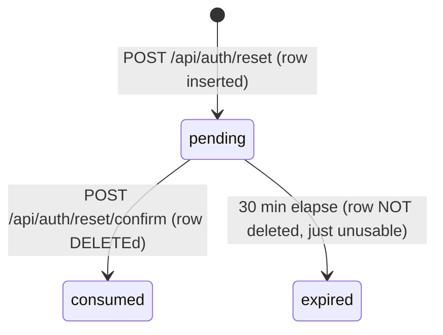

# Entity: ResetToken

## Fields (from `ticketd-nohistory/db/schema.sql:18-22` + usage in `app/server.py`)

| Field | Type | Constraint | Cited enforcement |
|---|---|---|---|
| `email` | TEXT | NOT NULL | no format validation anywhere — `request_reset` accepts `body.get("email", "")` with no shape check at all (`server.py:83`); an empty string is a valid "email" as far as this table is concerned |
| `token` | TEXT | NOT NULL | generated `hashlib.md5(f"{email}{time.time()}".encode()).hexdigest()` — **PB-002** |
| `created_ts` | REAL | NOT NULL | `time.time()` (Unix epoch float), used both for the 1-hour rate-limit window and the 30-minute expiry window |

No primary key, no uniqueness constraint on `token` (collision would let `SELECT ... WHERE
token = ?` return the wrong row if two ever collided — extremely unlikely with MD5+time, but
notably the schema does nothing to prevent it; PB-002's REPAIR should give this table a proper
unique/primary key on the new token as part of the fix, not just swap the generation algorithm).

## Lifecycle

Expired rows are **never cleaned up** — `confirm_reset` only deletes on successful consumption
(`server.py:106`). There is no expiry sweep/cron anywhere in the tree. `reset_tokens` grows
unbounded over the app's lifetime. Not user-reported as a problem, so `FIXED` (preserve as
observed) — but worth surfacing: this is exactly the kind of thing PB-003 (no DB access yet)
means we can't yet see the real row count / whether it already matters in practice.

## Invariants

- **Rate limit: 3 requests/hour per email**, counted via `COUNT(*) WHERE email = ? AND
  created_ts > now - 3600` (`server.py:85-88`). `FIXED`, cited — **except**:
- **`X-Internal-Bypass: 1` header skips the rate limit entirely**, no other check (`server.py:84`).
  Undocumented anywhere in the tree (no comment explaining who/what sends it, no config flag
  gating it — it's a bare header string literal). This is exactly the shape of behavior the
  fidelity taxonomy calls out as `ASK`: real, evidenced, intent unclear. Filed as **OQ-002**;
  it must NOT be silently ported as-is into a rewrite without a ruling, because reproducing an
  undocumented auth-bypass header verbatim in new code is a security decision, not a neutral port.
- **Expiry window: 30 minutes** (`RESET_WINDOW_MIN = 30`, `server.py:16,103`). `FIXED`, cited.
- **Non-disclosure: expired and invalid tokens return the identical error body** (`403
  {"error":"invalid_token"}`, `server.py:103-105`) — the code comment itself calls this
  "deliberate". `FIXED`, cited, high-confidence (self-documenting in source).
- **Single-use**: successful confirm deletes the row (`server.py:106`), so replaying the same
  token twice hits the invalid/expired branch on the second attempt. `FIXED`, cited.
- **Token is plaintext at rest** — `reset_tokens.token` stores the raw token, compared with a
  plain SQL equality (`server.py:101-102`), not a constant-time comparison. This compounds PB-002
  (MD5 generation): the REPAIR target should address storage as well as generation — see
  `modern/CLAUDE.md` architecture rules.

## Related PB entries

PB-002 (MD5 tokens) is this entity's defining defect. PB-001 also touches this entity's creation
path (`request_reset` sends the token by email synchronously).
