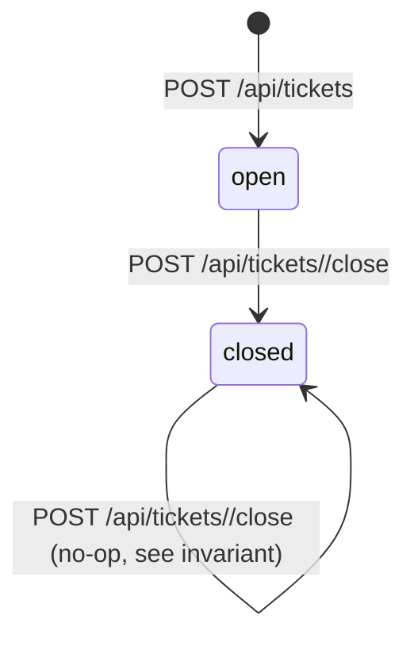

# Entity: Ticket

## Fields (from `ticketd-nohistory/db/schema.sql:1-10` + usage in `app/server.py`)

| Field | Type | Constraint | Cited enforcement |
|---|---|---|---|
| `id` | INTEGER | PRIMARY KEY | schema only (SQLite rowid alias) |
| `title` | TEXT | NOT NULL | DB constraint; also app-level: `create_ticket` rejects empty/whitespace-only title with 422 `{"error":"title_required"}` (`server.py:44-45`) — **app validation is stricter than the DB** (DB allows empty string `""`, app doesn't allow blank-after-strip) |
| `slug` | TEXT | NOT NULL | derived via `slugify(title)` (`app/util.py:4-6`); **not** enforced unique by the DB despite being a natural key — see Invariants below |
| `priority` | TEXT | CHECK IN ('low','med','high') | DB CHECK constraint (`schema.sql:5`) **and** app-level coercion (`server.py:47-49`) — see Invariants |
| `status` | TEXT | NOT NULL, CHECK IN ('open','closed') | DB CHECK; app only ever writes `'open'` (create) or `'closed'` (close) — no other transition exists in code |
| `assignee_id` | INTEGER | FK → users(id), nullable | **never set or read by any code path** — see `docs/00-overview.md#schema-code-gap`, OQ-005 |
| `created_at` | DATETIME | NOT NULL | app sets via `datetime.now().isoformat()` — **naive local time, not UTC** (`server.py:52`, flagged by the code's own comment `# naive local time!`) |
| `closed_at` | DATETIME | nullable | app sets via `datetime.now().isoformat()` on close (`server.py:71`), same naive-local-time characteristic |

## Lifecycle

Single one-way transition, `open -> closed`. No reopen, no other statuses, no code path found for
either. Cited: `server.py:69-70` (`UPDATE ... WHERE id = ? AND status != 'closed'` — closing an
already-closed ticket updates 0 rows, `close_ticket` returns `{"closed": false}` and does **not**
resend the notification email; confirmed by the `changed` rowcount guard at `server.py:73`).

## Invariants

- **Title required, non-blank-after-strip** — enforced at `server.py:43-45` (app layer only; the
  DB column is merely `NOT NULL`, so an empty string could reach the DB via any other write path
  — there is none in this app, but a future direct-DB writer would not be stopped). `FIXED`,
  cited.
- **Priority is one of `low`/`med`/`high`**, cited both as a DB CHECK (`schema.sql:5`) and as app
  logic that also accepts numeric-string aliases `"1"/"2"/"3"` mapped to
  `low/med/high` respectively, and passes through any other string value **unchecked at the app
  layer** relying on the DB CHECK to reject it (`server.py:47-49` has no `else` branch — a value
  like `"urgent"` would fail the INSERT with a `sqlite3.IntegrityError`, which the route does
  **not** catch, so the client would see a raw 500, not a clean 422). This 500-on-bad-priority
  behavior is `FIXED` (cited, no error handling exists to contradict it) even though it's
  surprising — not flagged as a defect because it wasn't reported in intake; noted for the audit.
- **Slug is not guaranteed unique** — no DB unique constraint on `slug`, and no app-level check
  before insert. The `slugify` docstring itself documents the collision case ("Fix DB" and
  "fix db!" collide). `FIXED` (preserve as-is; not brief-sanctioned to fix) — cited
  `app/util.py:5-6`.
- **`status != 'closed'` guard on close** — re-closing a closed ticket is a documented no-op
  (`{"closed": false}`, no email resent). `FIXED`, cited `server.py:69-77`.
- **`assignee_id` is inert** — schema allows it, nothing sets or reads it. Not an invariant so
  much as the *absence* of one; see OQ-005.

## Related PB entries

PB-001 (synchronous notification on close) touches this entity's close transition directly.
