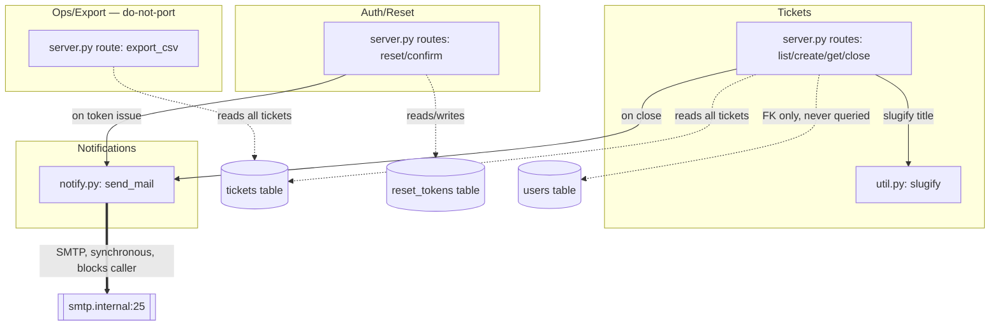

# System Overview — ticketd

ticketd is a small internal ticket tracker: a single Flask 1.x application (`ticketd/app/server.py`,
122 LOC) fronting a SQLite database, with two small support modules (`notify.py` for outbound
email, `util.py` for slug generation) and one dead one (`legacy_import.py`). It exposes 7 JSON/CSV
HTTP routes, no auth/session layer, and no background job runner — every side effect happens
synchronously inside the request that triggered it, which is the root cause of PB-001.

## Subsystems

| subsystem | responsibility | member modules | routes | tables |
|---|---|---|---|---|
| **Tickets** | CRUD-ish lifecycle for support tickets: create, list/filter, read-by-id, close | `app/server.py` (routes only — no separate module), `app/util.py` (slug generation) | `GET /api/tickets`, `POST /api/tickets`, `GET /api/tickets/<id>`, `POST /api/tickets/<id>/close` | `tickets` (writes), `users` (referenced by FK, never read/written by any route — see `docs/domain/users.md`) |
| **Auth/Reset** | Password-reset token issuance and consumption; the only "auth" surface in the app | `app/server.py` (routes only) | `POST /api/auth/reset`, `POST /api/auth/reset/confirm` | `reset_tokens` |
| **Notifications** | Outbound email, invoked synchronously by both Tickets (on close) and Auth/Reset (on token issuance) — the cross-cutting subsystem PB-001 is about | `app/notify.py` | none (not a route; a library called from the two above) | none |
| **Ops/Export** *(do-not-port — PB-009)* | Ad hoc CSV dump of all tickets, built for a 2020 audit, zero live callers | `app/server.py` (one route) | `GET /internal/export/csv` | `tickets` (read-only) |
| *(dead)* | One-off 2019 spreadsheet importer, zero callers anywhere in the tree | `app/legacy_import.py` | none | none |

There is no real module boundary in the legacy code — `server.py` is one file with all seven
route handlers inline — the "subsystems" above are a read of *intent* from route grouping and
table ownership, not an existing package structure. This is exactly the seam the FastAPI rewrite
should introduce (see `modern/CLAUDE.md` conventions: router-per-subsystem).

## Dependency diagram

## External integration points

- **Outbound SMTP** (`smtp.internal:25`, `app/notify.py:6`) — the only external dependency in the
  system. Called synchronously from two places: `close_ticket()` (`server.py:76`) and
  `request_reset()` (`server.py:94`). No retry, no circuit breaker, no async dispatch — a slow or
  down SMTP server directly degrades (PB-001) or fully blocks the calling HTTP request up to the
  30s `smtplib` timeout configured in `notify.py:6`.
- **No queue, no cron, no webhook receivers, no other outbound integrations** exist anywhere in
  the inventory (`inventory.json.external_deps` is stdlib + Flask only).
- **Caller**: the access-log evidence shows exactly one client identity across the whole sample —
  user-agent `svc-ui/2.1` — consistent with this being an internal tool with a single first-party
  UI client and no public/third-party API consumers in evidence. See OQ-007 (auth model) in
  `docs/open-questions.md`.

## Data flow summary

1. A ticket is created (`POST /api/tickets`) → slug derived from title (no uniqueness check,
   PB-003) → row inserted with naive-local `created_at` (PB-010, OQ-006).
2. A ticket is closed (`POST /api/tickets/<id>/close`) → status flips, `closed_at` stamped →
   synchronous email to a fixed distribution address (`watchers@example.internal`, hardcoded in
   `server.py:76`) → response only returns after SMTP completes (PB-001).
3. A password reset is requested (`POST /api/auth/reset`) → optional rate-limit check (bypassable
   via undocumented header, PB-008/OQ-002) → MD5 token minted (PB-002) → row inserted into
   `reset_tokens` → synchronous email with the token in plaintext body → response only returns
   after SMTP completes (PB-001, same mechanism, second call site).
4. A password reset is confirmed (`POST /api/auth/reset/confirm`) → token looked up, expiry
   checked (30 min window) → row deleted on success → same error body for "not found" and
   "expired" (deliberate non-disclosure, cited in-code, `server.py:104`).

No entity in this system is ever updated after creation except: `tickets.status`/`closed_at` (on
close) and `reset_tokens` (deleted on confirm or left to accumulate — no expiry sweep exists
anywhere, PB-002).
