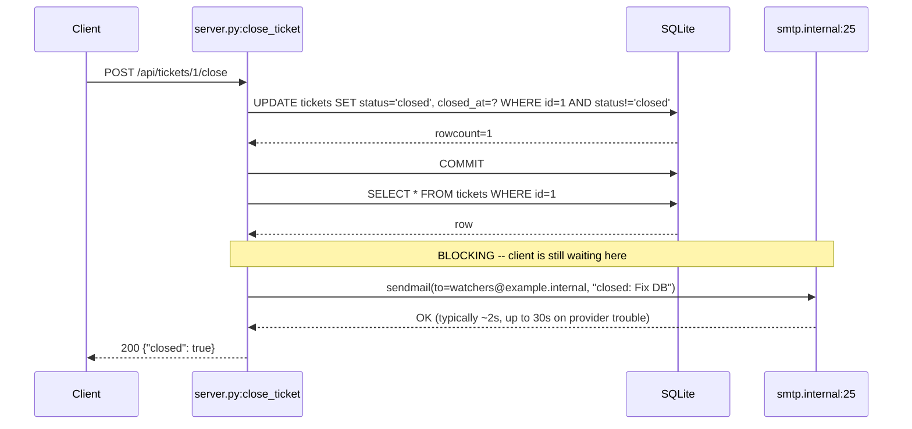
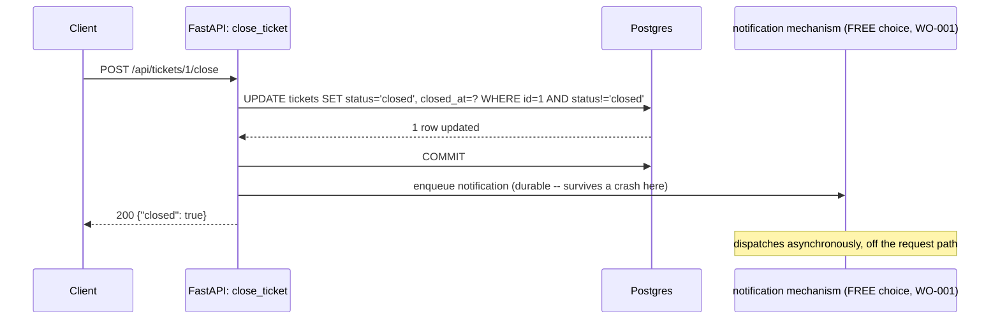

# Flow: closing a ticket (and why that's the whole story)

This is the flow PB-001 is about — the single most important story in this workspace. Real trace:
`verification/replay/traces/tickets-close.jsonl`, id `close-first-transition-001`, captured by
actually booting the legacy app (`verification/harness/run-legacy.sh`) and driving a real request
through it.

## Legacy — what happens today



Real captured request/response (`close-first-transition-001`):
```json
{"request": {"method": "POST", "path": "/api/tickets/1/close"},
 "response": {"status": 200, "body": {"closed": true}},
 "side_effects": {"notification": {"sent": true, "to": ["watchers@example.internal"],
                                    "body": "closed: Fix DB", "dispatch_mode": "sync"}}}
```

The client does not get its `200` back until the SMTP call finishes. In June 2026, SMTP was
having a bad day, and every ticket-close request queued up behind it. That's the whole outage.

## Modern — the design (not yet built)



Everything about the response — status code, body shape, when the DB transition is durable — is
identical (FIXED). The only thing that moves is *when* the email actually goes out, and that it's
no longer possible for a slow mail server to make this endpoint slow (ED-001).

## What stays exactly the same either way

- Closing an already-closed ticket, or a nonexistent id, is a no-op: `200 {"closed": false}`, no
  notification, indistinguishable between the two cases (see `close-idempotent-noop-002` and
  `close-nonexistent-id-003` in the same trace file).
- The recipient is always `watchers@example.internal` — never per-ticket, never derived from
  `assignee_id` (which no route in this app ever populates).
