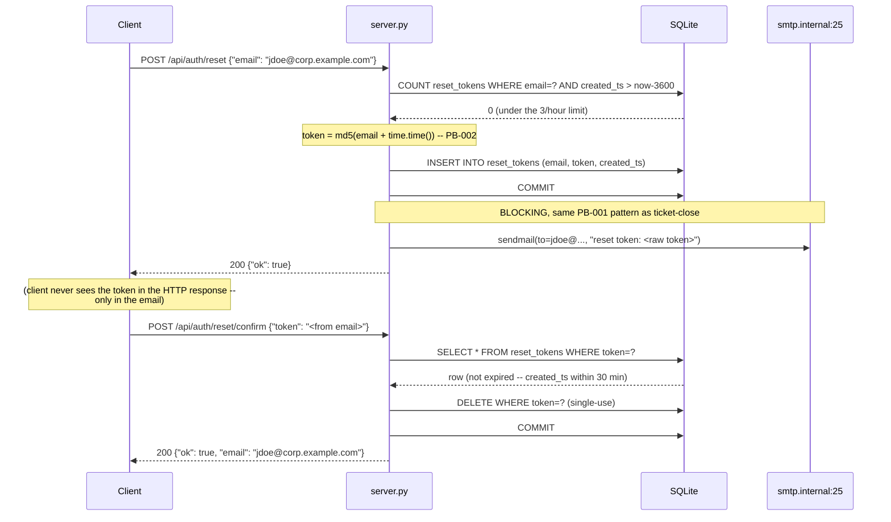
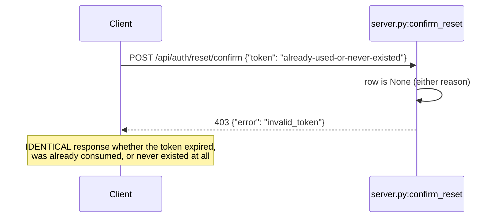

# Flow: password reset, request through confirm

Real traces: `verification/replay/traces/auth-reset.jsonl`, ids `reset-request-001` and
`reset-confirm-success-002` — both captured against a real booted legacy instance.

## Legacy — what happens today



Real captured data:
```json
// reset-request-001
{"response": {"status": 200, "body": {"ok": true}},
 "side_effects": {"notification": {"sent": true, "to": ["jdoe@corp.example.com"], "dispatch_mode": "sync"},
                   "token_mechanism": {"hash_algo": "md5", "storage": "plaintext-in-bare-table"}}}

// reset-confirm-success-002
{"response": {"status": 200, "body": {"ok": true, "email": "jdoe@corp.example.com"}}}
```

## The non-disclosure branch (equally important, easy to break by accident)



This is deliberate (a code comment says so explicitly) and must survive the token-mechanism
rewrite exactly. **Caveat worth knowing**: every trace currently in this workspace that exercises
this branch does so via an *already-consumed* token, not a token that's still present in the table
but genuinely past its 30-minute window — a P9 audit found that gap. The underlying claim is still
true (both cases hit the same code path in legacy), just not yet demonstrated by a captured trace
for the time-based case specifically.

## Modern — what changes, what doesn't

Rate limit (3/hour), 30-minute expiry, single-use, and the non-disclosure behavior above are all
FIXED — preserved exactly. What changes: the token itself (real randomness instead of
`md5(email+timestamp)`, hashed at rest instead of stored plaintext, with an actual expiry-cleanup
story instead of rows accumulating forever — PB-002/ED-002), and the notification dispatch moves
off the request path the same way ticket-close's does (PB-001/ED-001b, see `flows/close-ticket.md`
for that mechanism in detail).

One thing this flow deliberately does NOT show: the `X-Internal-Bypass` header that skips the rate
limit in legacy. It's real, it's traced (`reset-request-bypass-header-006`), and its fate in the
rewrite is still undecided — see `briefs/OQ-002-ruling-brief.md`.
