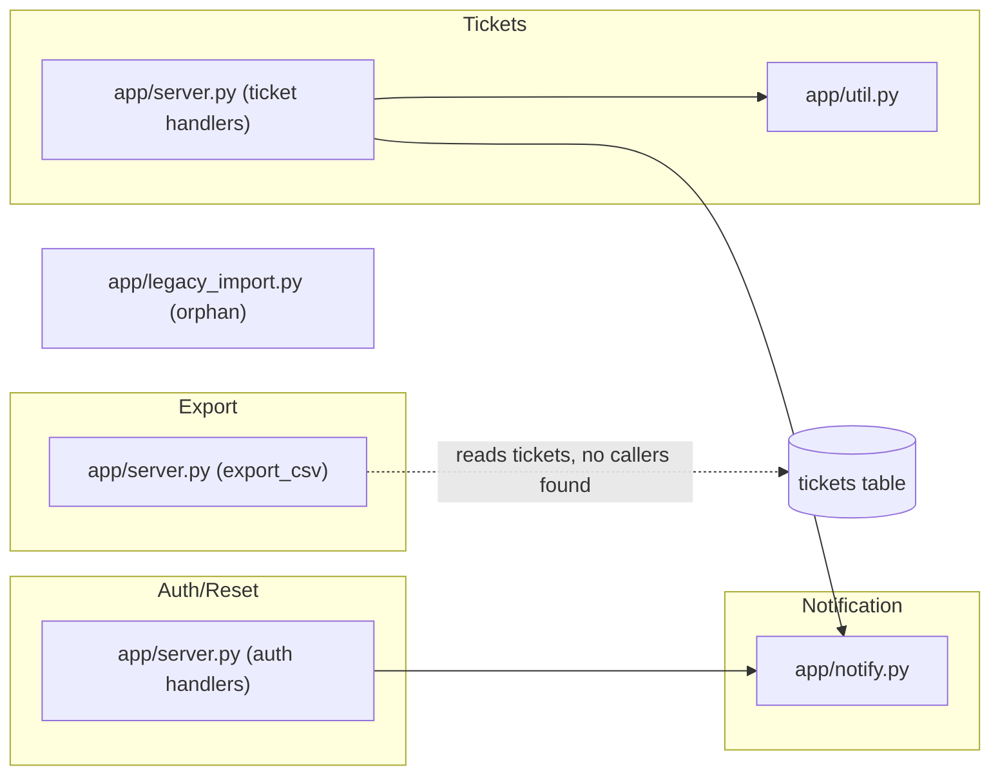

# System Overview — ticketd

`ticketd` is a small internal ticket tracker: a single-process Flask 1.x-era app
(`legacy/app/server.py`, in production "since 2019" per its module docstring) backed by SQLite,
exposing 7 JSON routes for ticket CRUD/lifecycle and a self-service password-reset flow, plus one
apparently-dead CSV export route. There is no authentication on any route in the legacy tree —
password reset issues a bearer-style token but nothing in this codebase gates the ticket routes
themselves (see `docs/open-questions.md` for what's unconfirmed vs. just absent).

## Subsystems

| Subsystem | Responsibility | Member modules | Routes | Tables |
|---|---|---|---|---|
| Tickets | Create/list/read/close tickets | `app/server.py` (ticket handlers), `app/util.py` (slugify) | `GET /api/tickets`, `POST /api/tickets`, `GET /api/tickets/<id>`, `POST /api/tickets/<id>/close` | `tickets` |
| Auth/Reset | Password-reset token issuance + redemption | `app/server.py` (auth handlers) | `POST /api/auth/reset`, `POST /api/auth/reset/confirm` | `reset_tokens` (`users` is referenced by `tickets.assignee_id` but not by this subsystem's own logic — no route reads/writes `users`) |
| Notification | Outbound email | `app/notify.py` | none (called from Tickets' close handler and Auth/Reset's request handler) | none |
| Export (candidate dead code) | Ad hoc CSV dump of tickets | `app/server.py` (`export_csv`) | `GET /internal/export/csv` | `tickets` (read-only) |
| Legacy import (candidate dead code) | One-off spreadsheet importer, not wired to any route | `app/legacy_import.py` | none | none (reads a CSV file path directly) |

Users/assignment exists only as schema (`db/schema.sql` — `users`, `tickets.assignee_id`); no
route in the legacy tree reads or writes either. See `docs/open-questions.md#OQ-004`.

## Dependency diagram

Note: `app/server.py` is drawn split by subsystem above since it's one physical file containing
three subsystems' handlers — the file boundary and the subsystem boundary don't coincide here.
This is itself a P4 fan-out consideration: work orders are organized by subsystem/behavior, not
by file.

## External integration points

- **Outbound SMTP**: `app/notify.py:send_mail()` connects to `smtp.internal:25` synchronously
  (PB-001). Two call sites: `close_ticket` (legacy/app/server.py:76) and `request_reset`
  (legacy/app/server.py:94). No inbound webhook or queue integration exists anywhere in the tree.
- **No cron/scheduled jobs** found in the legacy tree.
- **No auth/session integration** — no middleware, no session table beyond `reset_tokens`, no
  token-based auth guarding the ticket routes. Not flagged as a defect (no PB entry says so) but
  recorded here since it's easy to assume a system like this has some access control and it does
  not, as far as this code shows.

## Data flow at a glance

1. `POST /api/tickets` → validates title, computes slug, inserts `tickets` row with
   `status='open'`. No `send_mail` call on create.
2. `POST /api/tickets/<id>/close` → flips status to `closed` (only if not already closed),
   synchronously emails `watchers@example.internal` (PB-001).
3. `POST /api/auth/reset` → rate-limited by email (3/hour, bypassable via undocumented header,
   `docs/open-questions.md#OQ-001`), issues an MD5-derived token (PB-002), synchronously emails
   the token to the requester (PB-001 again — same defect, second call site).
4. `POST /api/auth/reset/confirm` → redeems a token within a 30-minute window; expired and
   invalid tokens return an identical error body (deliberate non-disclosure, evidenced in-code,
   carried forward as FIXED).
