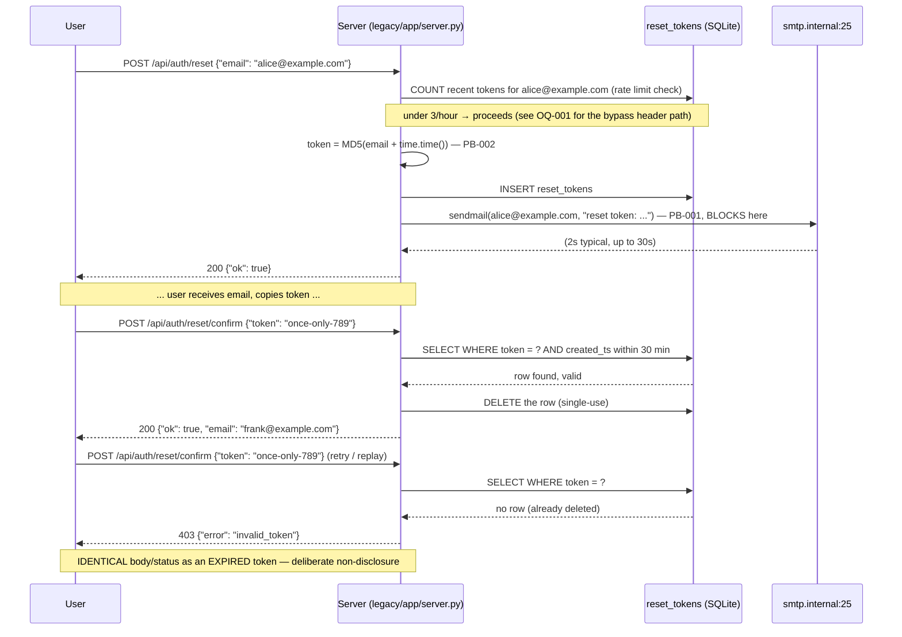

# Flow: Password reset (request → confirm)

Two separate captured traces stitched into one storyboard — `reset-request-happy` (a fresh
request) and `reset-confirm-single-use` (a confirm, then a second confirm with the same token).
They use different seeded emails/tokens (the corpus seeds each trace independently — see
`verification/harness/README.md`), so read this as "the shape of the flow," not one continuous
literal session. Both traces are T2 — captured by actually booting `legacy/app/server.py`, not
hand-written — see `verification/replay/traces/auth-reset.legacy.jsonl`.



## Annotated real trace: the request

```json
{
  "request": {"method": "POST", "path": "/api/auth/reset", "json": {"email": "alice@example.com"}},
  "response": {"status": 200, "body": {"ok": true}},
  "state": {
    "db_dump": {"reset_tokens": [{"email": "alice@example.com",
      "token": "3669240a67756b47f5fac592577d6c35", "created_ts": 1786285204.268307}]},
    "email_dispatch": {"mode": "sync", "to": ["alice@example.com"], "kind": "reset_token_issued"}
  }
}
```

Three things worth pointing at directly:
1. `token` is 32 lowercase-hex characters — the signature of an MD5 digest. This is exactly what
   `WO-003` replaces; after the fix, a token this shape should never appear again (see
   `verification/characterization/test_auth_reset.py::test_reset_token_is_not_md5_shaped`).
2. `email_dispatch.mode` is `"sync"` — captured because the harness intercepts `smtplib.SMTP` in
   -process; this is the literal field `expected-divergences.yaml`'s `ED-002` checks flips to
   `"queued"` once `WO-004` exists.
3. The response body never contains the token. The user only learns it via the email — which is
   also why `email_dispatch` (not the HTTP response) is where this harness watches for the fix.

## Annotated real trace: the confirm, twice

```json
{"request": {"json": {"token": "once-only-789"}}, "response": {"status": 200, "body": {"ok": true, "email": "frank@example.com"}}}
{"request": {"json": {"token": "once-only-789"}}, "response": {"status": 403, "body": {"error": "invalid_token"}}}
```

Same token, two calls, two different outcomes — captured in a single multi-step trace
specifically to prove deletion-on-redemption is real, not just claimed. The second call's `403`
is byte-identical to what an EXPIRED (but never-redeemed) token also returns — see
`verification/characterization/test_auth_reset.py::test_confirm_expired_and_invalid_share_identical_body`
for the direct comparison.
